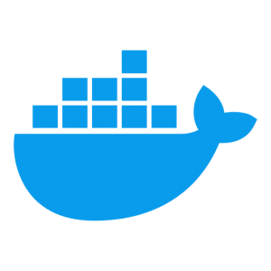

# Full Stack Developer Challenge

<div style="display: flex; flex-wrap: wrap; margin-bottom: 40px">
  
  
  
  
  
  
  
  
  
  
  
  
</div>

Client and server for the Review performance project. It features:

#### 1. Login page

#### 2. Admin - Employees page

- CRUD for users.
- SearchForm filter by user name.
- Assign reviewer popover.

#### 3. Auth - Reviews

- Tabs: Pending | Completed reviews
- Write on a pending review.
- View pasts reviews details

## Features

- Pagination
- Web app manifest
- SEO
- Responsive
- Internationalization (Lingui)
- Server side rendering (Next)
- Form validation (yup & react-hook-forms)
- TypeScript typings
- GraphQL Playground

## Getting Started

1. Clone the repo to your local machine by running `git clone https://github.com/zeddz92/FullStackEngineerChallenge.git`.
2. Checkout the branch `paypay` by running `git checkout paypay`

### Prerequisites

To start using the project, make sure you:

1. <a href="https://www.docker.com/products/docker-desktop" target="_blank">Download and install the latest version of docker and CLI.</a>
2. <a href="https://nodejs.org/en/download/" target="_blank">Install npm</a>

### Installing

##### Setting up Client

```shell
$ cd client
$ npm i
$ npm run build
```

##### Setting up API

```shell
$ cd api
$ npm i
$ docker-compose up
$ npm run db:migrate:latest
$ npm run db:seed:run
```

You might need to wait a few minutes until `docker` sets everything up before running `seeds` and `migrations`

## Usage

Run development scripts for both api and client

```shell
$ cd api
$ npm run dev
```

```shell
$ cd client
$ npm run start
```

##### Credentials

##### **Admin**

```
Email: admin@paypay.com
Password: password
```

##### **Employee**

```
Email: jDoe@paypay.com
Password: password
```

## Running the tests (only api)

These tests will check that data returned when a query or mutation is executed and validated.

```shell
$ cd api
$ npm run test
```

##### Tests Workflow

1. Run the latest migrations on the test database.
2. Each test will populate the test database with the necessary data for request to work.
3. After each test, the tables will be truncated.
4. After all the tests finished running, delete all the tables in the test database.
